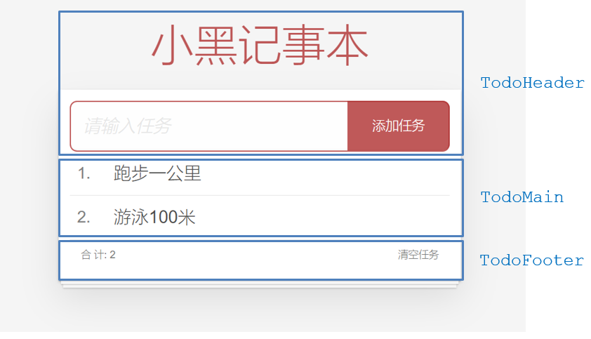

## 综合案例-小黑记事本（组件拆分版）

### 1.需求说明

- 拆分基础组件
- 渲染待办任务
- 添加任务
- 删除任务
- 底部合计 和 清空功能
- 持久化存储

### 2.拆分基础组件

咱们可以把小黑记事本原有的结构拆成三部分内容：头部（TodoHeader）、列表(TodoMain)、底部(TodoFooter)

## 一、综合案例-列表渲染

思路分析：

1. 提供数据：提供在公共的父组件 App.vue
2. 通过父传子，将数据传递给TodoMain
3. 利用v-for进行渲染

## 二、综合案例-添加功能

思路分析：

1. 收集表单数据  v-model
2. 监听时间 （回车+点击 都要进行添加）
3. 子传父，将任务名称传递给父组件App.vue
4. 父组件接受到数据后 进行添加 **unshift**(自己的数据自己负责)

## 三、综合案例-删除功能

思路分析：

1. 监听时间（监听删除的点击）携带id
2. 子传父，将删除的id传递给父组件App.vue
3. 进行删除 **filter**  (自己的数据自己负责)

## 四、综合案例-底部功能及持久化存储

思路分析：

1. 底部合计：父组件传递list到底部组件  —>展示合计
2. 清空功能：监听事件 —> **子组件**通知父组件 —>父组件清空
3. 持久化存储：watch监听数据变化，持久化到本地