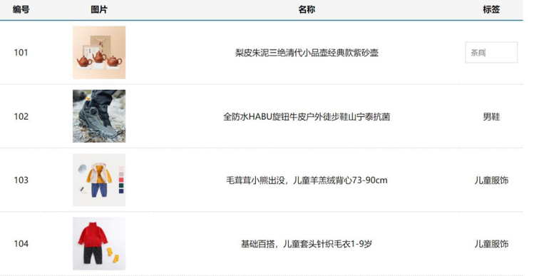

## 综合案例 - 商品列表-MyTag组件抽离



### 1.需求说明

1. **my-tag 标签组件封装**

​    (1) 双击显示输入框，输入框获取焦点

​    (2) 失去焦点，隐藏输入框

​    (3) 回显标签信息

​    (4) 内容修改，回车 → 修改标签信息

2. **my-table 表格组件封装**

​    (1) 动态传递表格数据渲染

​    (2) 表头支持用户自定义

​    (3) 主体支持用户自定义

### 2.代码准备

```vue
<template>
  <div class="table-case">
    <table class="my-table">
      <thead>
        <tr>
          <th>编号</th>
          <th>名称</th>
          <th>图片</th>
          <th width="100px">标签</th>
        </tr>
      </thead>
      <tbody>
        <tr>
          <td>1</td>
          <td>梨皮朱泥三绝清代小品壶经典款紫砂壶</td>
          <td>
            
          </td>
          <td>
            <div class="my-tag">
              <!-- <input 
                class="input"
                type="text"
                placeholder="输入标签"
              /> -->
              <div class="text">
                茶具
              </div>
            </div>
          </td>
        </tr>
        <tr>
          <td>1</td>
          <td>梨皮朱泥三绝清代小品壶经典款紫砂壶</td>
          <td>
            
          </td>
          <td>
            <div class="my-tag">
              <!-- <input
                ref="inp"
                class="input"
                type="text"
                placeholder="输入标签"
              /> -->
              <div class="text">
                男靴
              </div>
            </div>
          </td>
        </tr>
      </tbody>
    </table>
  </div>
</template>

<script>
export default {
  name: 'TableCase',
  components: {},
  data() {
    return {
      goods: [
        {
          id: 101,
          picture:
            'https://yanxuan-item.nosdn.127.net/f8c37ffa41ab1eb84bff499e1f6acfc7.jpg',
          name: '梨皮朱泥三绝清代小品壶经典款紫砂壶',
          tag: '茶具',
        },
        {
          id: 102,
          picture:
            'https://yanxuan-item.nosdn.127.net/221317c85274a188174352474b859d7b.jpg',
          name: '全防水HABU旋钮牛皮户外徒步鞋山宁泰抗菌',
          tag: '男鞋',
        },
        {
          id: 103,
          picture:
            'https://yanxuan-item.nosdn.127.net/cd4b840751ef4f7505c85004f0bebcb5.png',
          name: '毛茸茸小熊出没，儿童羊羔绒背心73-90cm',
          tag: '儿童服饰',
        },
        {
          id: 104,
          picture:
            'https://yanxuan-item.nosdn.127.net/56eb25a38d7a630e76a608a9360eec6b.jpg',
          name: '基础百搭，儿童套头针织毛衣1-9岁',
          tag: '儿童服饰',
        },
      ],
    }
  },
}
</script>

<style lang="less" scoped>
.table-case {
  width: 1000px;
  margin: 50px auto;
  img {
    width: 100px;
    height: 100px;
    object-fit: contain;
    vertical-align: middle;
  }

  .my-table {
    width: 100%;
    border-spacing: 0;
    img {
      width: 100px;
      height: 100px;
      object-fit: contain;
      vertical-align: middle;
    }
    th {
      background: #f5f5f5;
      border-bottom: 2px solid #069;
    }
    td {
      border-bottom: 1px dashed #ccc;
    }
    td,
    th {
      text-align: center;
      padding: 10px;
      transition: all 0.5s;
      &.red {
        color: red;
      }
    }
    .none {
      height: 100px;
      line-height: 100px;
      color: #999;
    }
  }
  .my-tag {
    cursor: pointer;
    .input {
      appearance: none;
      outline: none;
      border: 1px solid #ccc;
      width: 100px;
      height: 40px;
      box-sizing: border-box;
      padding: 10px;
      color: #666;
      &::placeholder {
        color: #666;
      }
    }
  }
}
</style>
```

### 3.my-tag组件封装-创建组件

MyTag.vue

```vue
<template>
  <div class="my-tag">
  <!--  <input
      class="input"
      type="text"
      placeholder="输入标签" 
    /> -->
    <div  
      class="text">
       茶具
    </div>
  </div>
</template>

<script>
export default {
 
}
</script>

<style lang="less" scoped>
.my-tag {
  cursor: pointer;
  .input {
    appearance: none;
    outline: none;
    border: 1px solid #ccc;
    width: 100px;
    height: 40px;
    box-sizing: border-box;
    padding: 10px;
    color: #666;
    &::placeholder {
      color: #666;
    }
  }
}
</style>
```

App.vue

```vue
<template>
  ...
 <tbody>
       <tr>
          ....
          <td>
            <MyTag></MyTag>
          </td>
       </tr>
 </tbody>
 ...
</template>
<script>
import MyTag from './components/MyTag.vue'
export default {
  name: 'TableCase',
  components: {
    MyTag,
  },
 ....
 </script>
```

## 综合案例 - MyTag组件控制显示隐藏

MyTag.vue

```vue
<template>
  <div class="my-tag">
    <input
      v-if="isEdit"
      v-focus
      ref="inp"
      class="input"
      type="text"
      placeholder="输入标签" 
      @blur="isEdit = false" 
    />
    <div 
      v-else
      @dblclick="handleClick"
      class="text">
       茶具
    </div>
  </div>
</template>

<script>
export default {
  data () {
    return {
      isEdit: false
    }
  },
  methods: {
    handleClick () {
      this.isEdit = true
    }
  }
}
</script> 
```

main.js

```js
// 封装全局指令 focus
Vue.directive('focus', {
  // 指令所在的dom元素，被插入到页面中时触发
  inserted (el) {
    el.focus()
  }
})
```

## 综合案例 - yTag组件进行v-model绑定

App.vue

```vue
<MyTag v-model="tempText"></MyTag>
<script>
    export default {
        data(){
            tempText:'水杯'
        }
    }
</script>
```

MyTag.vue

```
<template>
  <div class="my-tag">
    <input
      v-if="isEdit"
      v-focus
      ref="inp"
      class="input"
      type="text"
      placeholder="输入标签"
      :value="value"
      @blur="isEdit = false"
      @keyup.enter="handleEnter"
    />
    <div 
      v-else
      @dblclick="handleClick"
      class="text">
      {{ value }}
    </div>
  </div>
</template>

<script>
export default {
  props: {
    value: String
  },
  data () {
    return {
      isEdit: false
    }
  },
  methods: {
    handleClick () {
      this.isEdit = true
    },
    handleEnter (e) {
      // 非空处理
      if (e.target.value.trim() === '') return alert('标签内容不能为空')
      this.$emit('input', e.target.value)
      // 提交完成，关闭输入状态
      this.isEdit = false
    }
  }
}
</script> 
```

## 综合案例 - 封装MyTable组件-动态渲染数据

App.vue

```vue
<template>
  <div class="table-case">
    <MyTable :data="goods"></MyTable>
  </div>
</template>

<script>
import MyTable from './components/MyTable.vue'
export default {
  name: 'TableCase',
  components: { 
    MyTable
  },
  data(){
    return {
        ....
    }
  },
}
</script> 
```

MyTable.vue
```vue
<template>
  <table class="my-table">
    <thead>
      <tr>
        <th>编号</th>
        <th>名称</th>
        <th>图片</th>
        <th width="100px">标签</th>
      </tr>
    </thead>
    <tbody>
      <tr v-for="(item, index) in data" :key="item.id">
       <td>{{ index + 1 }}</td>
        <td>{{ item.name }}</td>
        <td>
          
        </td>
        <td>
          标签内容
         <!-- <MyTag v-model="item.tag"></MyTag> -->
        </td>
      </tr>
    </tbody>
  </table>
</template>

<script>
export default {
  props: {
    data: {
      type: Array,
      required: true
    }
  }
};
</script>

<style lang="less" scoped>

.my-table {
  width: 100%;
  border-spacing: 0;
  img {
    width: 100px;
    height: 100px;
    object-fit: contain;
    vertical-align: middle;
  }
  th {
    background: #f5f5f5;
    border-bottom: 2px solid #069;
  }
  td {
    border-bottom: 1px dashed #ccc;
  }
  td,
  th {
    text-align: center;
    padding: 10px;
    transition: all .5s;
    &.red {
      color: red;
    }
  }
  .none {
    height: 100px;
    line-height: 100px;
    color: #999;
  }
}

</style>
```

## 综合案例 - 封装MyTable组件-自定义结构

App.vue
```vue
<template>
  <div class="table-case">
    <MyTable :data="goods">
      <template #head>
        <th>编号</th>
        <th>名称</th>
        <th>图片</th>
        <th width="100px">标签</th>
      </template>

      <template #body="{ item, index }">
        <td>{{ index + 1 }}</td>
        <td>{{ item.name }}</td>
        <td>
          
        </td>
        <td>
          <MyTag v-model="item.tag"></MyTag>
        </td>
      </template>
    </MyTable>
  </div>
</template>

<script>
import MyTag from './components/MyTag.vue'
import MyTable from './components/MyTable.vue'
export default {
  name: 'TableCase',
  components: {
    MyTag,
    MyTable
  },
  data () {
    return {
      ....
  }
}
</script>
```

MyTable.vue
```vue
<template>
  <table class="my-table">
    <thead>
      <tr>
        <slot name="head"></slot>
      </tr>
    </thead>
    <tbody>
      <tr v-for="(item, index) in data" :key="item.id">
        <slot name="body" :item="item" :index="index" ></slot>
      </tr>
    </tbody>
  </table>
</template>

<script>
export default {
  props: {
    data: {
      type: Array,
      required: true
    }
  }
};
</script>
```
