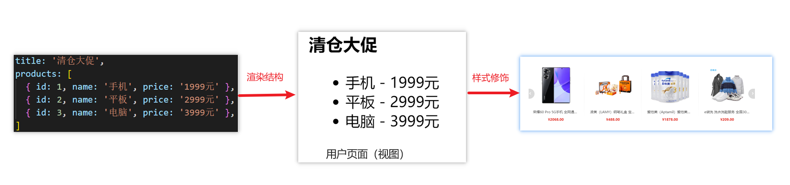

## 一、为什么要学习Vue

1.前端必备技能

2.岗位多，绝大互联网公司都在使用Vue

3.提高开发效率

4.高薪必备技能（Vue2+Vue3）


## 二、什么是Vue

概念：Vue (读音 /vjuː/，类似于 view) 是一套 **构建用户界面** 的 **渐进式** **框架**

1.Vue2官网：<https://v2.cn.vuejs.org/>

2.Vue3官网：<https://v3.cn.vuejs.org/>

### 1.什么是构建用户界面

**基于数据**渲染出用户可以看到的**界面**



### 2.什么是渐进式

所谓渐进式就是循序渐进，不一定非得把Vue中的所有API都学完才能开发Vue，可以学一点开发一点

#### Vue的两种开发方式：

1. Vue核心包开发

   场景：局部模块改造

2. Vue核心包&Vue插件&工程化

   场景：整站开发


### 3.什么是框架

所谓框架：就是一套完整的解决方案

**举个栗子**	

如果把一个完整的项目比喻为一个装修好的房子，那么框架就是一个毛坯房。

我们只需要在“毛坯房”的基础上，增加功能代码即可。

提到框架，不得不提一下库。

- 库，类似工具箱，是一堆方法的集合，比如 axios、lodash、echarts等
- 框架，是一套完整的解决方案，实现了大部分功能，我们只需要按照一定的规则去编码即可。

下图是 库 和 框架的对比。


框架的特点：有一套必须让开发者遵守的**规则**或者**约束**

咱们学框架就是学习的这些规则 [官网](https://v2.cn.vuejs.org/)

### 总结：什么是Vue？

Vue是什么：

什么是构建用户界面：

什么是渐进式：

什么是框架：

## 三、创建Vue实例

我们已经知道了Vue框架可以 基于数据帮助我们渲染出用户界面，那应该怎么做呢？


比如就上面这个数据，基于提供好的msg 怎么渲染后右侧可展示的数据呢？

**核心步骤（4步）：**

1. 准备容器
2. 引包（官网） — 开发版本/生产版本
3. 创建Vue实例  new Vue()
4. 指定配置项，渲染数据
   1. el:指定挂载点
   2. data提供数据


**总结：创建Vue实例需要执行哪4步**


## 四、插值表达式 {{}}

插值表达式是一种Vue的模板语法

我们可以用插值表达式渲染出Vue提供的数据


### 1.作用：利用表达式进行插值，渲染到页面中

表达式：是可以被求值的代码，JS引擎会讲其计算出一个结果

以下的情况都是表达式：
```js
money + 100
money - 100
money * 10
money / 10 
price >= 100 ? '真贵':'还行'
obj.name
arr[0]
fn()
obj.fn()
```

### 2.语法

插值表达式语法：{{ 表达式 }}

```js
<h3>{{title}}<h3>

<p>{{nickName.toUpperCase()}}</p>

<p>{{age >= 18 ? '成年':'未成年'}}</p>

<p>{{obj.name}}</p>

<p>{{fn()}}</p>
```


### 3.错误用法

```js
1.在插值表达式中使用的数据 必须在data中进行了提供
<p>{{hobby}}</p>  //如果在data中不存在 则会报错

2.支持的是表达式，而非语句，比如：if   for ...
<p>{{if}}</p>

3.不能在标签属性中使用 {{  }} 插值 (插值表达式只能标签中间使用)
<p title="{{username}}">我是P标签</p>
```


### 4.总结

1.插值表达式的作用是什么

2.语法是什么

3.插值表达式的注意事项

## 五、响应式特性

### 1.什么是响应式？

​	简单理解就是数据变，视图对应变。 


### 2.如何访问 和 修改 data中的数据（响应式演示）

data中的数据, 最终会被添加到实例上

① 访问数据： "实例.属性名"

② 修改数据： "实例.属性名"= "值"


### 3.总结

1.  什么是响应式
2.  如何访问和修改data中的数据呢


## 六、Vue开发者工具安装

1. 通过谷歌应用商店安装（国外网站）
2. 极简插件下载（推荐） <https://chrome.zzzmh.cn/index>

安装步骤：


安装之后可以F12后看到多一个Vue的调试面板


---
lastUpdated: true
---