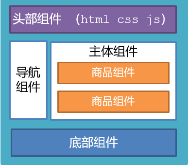

## 一、学不明白等于白玩

### 1.生命周期

1. 生命周期介绍
2. 生命周期的四个阶段
3. 生命周期钩子
4. 声明周期案例


### 2.综合案例-小黑记账清单

1. 列表渲染
2. 添加/删除
3. 饼图渲染


### 3.工程化开发入门

1. 工程化开发和脚手架
2. 项目运行流程
3. 组件化
4. 组件注册


### 4.综合案例-小兔仙首页

1. 拆分模块-局部注册 
2. 结构样式完善 
3. 拆分组件 – 全局注册


## 二、Vue生命周期

思考：什么时候可以发送初始化渲染请求？（越早越好）什么时候可以开始操作dom？（至少dom得渲染出来）

Vue生命周期：就是一个Vue实例从创建 到 销毁 的整个过程。

生命周期四个阶段：① 创建 ② 挂载 ③ 更新 ④ 销毁

1.创建阶段：创建响应式数据

2.挂载阶段：渲染模板

3.更新阶段：修改数据，更新视图

4.销毁阶段：销毁Vue实例


## 三、Vue生命周期钩子

Vue生命周期过程中，会**自动运行一些函数**，被称为【**生命周期钩子**】→  让开发者可以在【**特定阶段**】运行**自己的代码**


```html
<div id="app">
    <h3>{{ title }}</h3>
    <div>
      <button @click="count--">-</button>
      <span>{{ count }}</span>
      <button @click="count++">+</button>
    </div>
  </div>
  <script src="https://cdn.jsdelivr.net/npm/vue@2/dist/vue.js"></script>
  <script>
    const app = new Vue({
      el: '#app',
      data: {
        count: 100,
        title: '计数器'
      },
      // 1. 创建阶段（准备数据）
     

      // 2. 挂载阶段（渲染模板）
      

      // 3. 更新阶段(修改数据 → 更新视图)
      

      // 4. 卸载阶段
     
    })
  </script>
```


## 四、生命周期钩子小案例

### 1.在created中发送数据

```html
 <style>
    * {
      margin: 0;
      padding: 0;
      list-style: none;
    }
    .news {
      display: flex;
      height: 120px;
      width: 600px;
      margin: 0 auto;
      padding: 20px 0;
      cursor: pointer;
    }
    .news .left {
      flex: 1;
      display: flex;
      flex-direction: column;
      justify-content: space-between;
      padding-right: 10px;
    }
    .news .left .title {
      font-size: 20px;
    }
    .news .left .info {
      color: #999999;
    }
    .news .left .info span {
      margin-right: 20px;
    }
    .news .right {
      width: 160px;
      height: 120px;
    }
    .news .right img {
      width: 100%;
      height: 100%;
      object-fit: cover;
    }
  </style>

 <div id="app">
    <ul>
      <li class="news">
        <div class="left">
          <div class="title">5G商用在即，三大运营商营收持续下降</div>
          <div class="info">
            <span>新京报经济新闻</span>
            <span>2222-10-28 11:50:28</span>
          </div>
        </div>
        <div class="right">
          
        </div>
      </li>

      <li class="news">
        <div class="left">
          <div class="title">5G商用在即，三大运营商营收持续下降</div>
          <div class="info">
            <span>新京报经济新闻</span>
            <span>2222-10-28 11:50:28</span>
          </div>
        </div>
        <div class="right">
          
        </div>
      </li>

      <li class="news">
        <div class="left">
          <div class="title">5G商用在即，三大运营商营收持续下降</div>
          <div class="info">
            <span>新京报经济新闻</span>
            <span>2222-10-28 11:50:28</span>
          </div>
        </div>
        <div class="right">
          
        </div>
      </li>
    </ul>
  </div>
  <script src="https://cdn.jsdelivr.net/npm/vue@2/dist/vue.js"></script>
  <script src="https://cdn.jsdelivr.net/npm/axios/dist/axios.min.js"></script>
  <script>
    // 接口地址：http://hmajax.itheima.net/api/news
    // 请求方式：get
    const app = new Vue({
      el: '#app',
      data: {
        list: []
      }
    })
  </script>
```


### 2.在mounted中获取焦点

```html
 <style>
    html,
    body {
      height: 100%;
    }
    .search-container {
      position: absolute;
      top: 30%;
      left: 50%;
      transform: translate(-50%, -50%);
      text-align: center;
    }
    .search-container .search-box {
      display: flex;
    }
    .search-container img {
      margin-bottom: 30px;
    }
    .search-container .search-box input {
      width: 512px;
      height: 16px;
      padding: 12px 16px;
      font-size: 16px;
      margin: 0;
      vertical-align: top;
      outline: 0;
      box-shadow: none;
      border-radius: 10px 0 0 10px;
      border: 2px solid #c4c7ce;
      background: #fff;
      color: #222;
      overflow: hidden;
      box-sizing: content-box;
      -webkit-tap-highlight-color: transparent;
    }
    .search-container .search-box button {
      cursor: pointer;
      width: 112px;
      height: 44px;
      line-height: 41px;
      line-height: 42px;
      background-color: #ad2a27;
      border-radius: 0 10px 10px 0;
      font-size: 17px;
      box-shadow: none;
      font-weight: 400;
      border: 0;
      outline: 0;
      letter-spacing: normal;
      color: white;
    }
    body {
      background: no-repeat center /cover;
      background-color: #edf0f5;
    }
  </style>

<div class="container" id="app">
  <div class="search-container">
    
    <div class="search-box">
      <input type="text" v-model="words" id="inp">
      <button>搜索一下</button>
    </div>
  </div>
</div>

<script src="https://cdn.jsdelivr.net/npm/vue@2/dist/vue.js"></script>
<script>
  const app = new Vue({
    el: '#app',
    data: {
      words: ''
    }
  })
</script>
```


## 五、工程化开发和脚手架

### 1.开发Vue的两种方式

- 核心包传统开发模式：基于html / css / js 文件，直接引入核心包，开发 Vue。
- **工程化开发模式：基于构建工具（例如：webpack）的环境中开发Vue。**


工程化开发模式优点：

   提高编码效率，比如使用JS新语法、Less/Sass、Typescript等通过webpack都可以编译成浏览器识别的ES3/ES5/CSS等

工程化开发模式问题：

- webpack配置**不简单**
- **雷同**的基础配置
- 缺乏**统一的标准**

为了解决以上问题，所以我们需要一个工具，生成标准化的配置


### 2.脚手架Vue CLI

####   基本介绍：

   Vue CLI 是Vue官方提供的一个**全局命令工具**

   可以帮助我们**快速创建**一个开发Vue项目的**标准化基础架子**。【集成了webpack配置】

####    好处：

1. 开箱即用，零配置
2. 内置babel等工具
3. 标准化的webpack配置

####    使用步骤：

1. 全局安装（只需安装一次即可） yarn global add @vue/cli 或者 npm i @vue/cli -g
2. 查看vue/cli版本： vue --version
3. 创建项目架子：**vue create project-name**(项目名不能使用中文)
4. 启动项目：**yarn serve** 或者 **npm run serve**(命令不固定，找package.json)


## 六、项目目录介绍和运行流程

### 1.项目目录介绍


虽然脚手架中的文件有很多，目前咱们只需人事三个文件即可

1. main.js  入口文件
2. App.vue  App根组件 
3. index.html 模板文件

### 2.运行流程


## 七、组件化开发

​     组件化：一个页面可以拆分成一个个组件，每个组件有着自己独立的结构、样式、行为。

​     好处：便于维护，利于复用 → 提升开发效率。

​     组件分类：普通组件、根组件。

​      比如：下面这个页面，可以把所有的代码都写在一个页面中，但是这样显得代码比较混乱，难易维护。咱们可以按模块进行组件划分



总结：

组件化的好处是什么？

组件的分类？


## 八、根组件 App.vue

### 1.根组件介绍

整个应用最上层的组件，包裹所有普通小组件


### 2.组件是由三部分构成

- 语法高亮插件


- 三部分构成

  - template：结构 （有且只能一个根元素）
  - script:   js逻辑 
  - style： 样式 (可支持less，需要装包)

- 让组件支持less

  （1） style标签，lang="less" 开启less功能 

  （2） 装包: yarn add less less-loader -D 或者npm i less less-loader -D

### 3.总结

App组件包含哪三部分？


## 九、普通组件的注册使用-局部注册

### 1.特点：

只能在注册的组件内使用

### 2.步骤：

1. 创建.vue文件（三个组成部分）
2. 在使用的组件内先导入再注册，最后使用

### 3.使用方式：

当成html标签使用即可  <组件名></组件名>

### 4.注意：

组件名规范 —> 大驼峰命名法， 如 HmHeader

### 5.语法：


```js
// 导入需要注册的组件
import 组件对象 from '.vue文件路径'
import HmHeader from './components/HmHeader'

export default {  // 局部注册
  components: {
   '组件名': 组件对象,
    HmHeader:HmHeaer,
    HmHeader
  }
}
```


### 6.练习

在App组件中，完成以下练习。在App.vue中使用组件的方式完成下面布局


```vue
<template>
  <div class="hm-header">
    我是hm-header
  </div>
</template>

<script>
export default {

}
</script>

<style>
.hm-header {
  height: 100px;
  line-height: 100px;
  text-align: center;
  font-size: 30px;
  background-color: #8064a2;
  color: white;
}
</style>
```

```vue
<template>
  <div class="hm-main">
    我是hm-main
  </div>
</template>

<script>
export default {

}
</script>

<style>
.hm-main {
  height: 400px;
  line-height: 400px;
  text-align: center;
  font-size: 30px;
  background-color: #f79646;
  color: white;
  margin: 20px 0;
}
</style>
```

```vue
<template>
  <div class="hm-footer">
    我是hm-footer
  </div>
</template>

<script>
export default {

}
</script>

<style>
.hm-footer {
  height: 100px;
  line-height: 100px;
  text-align: center;
  font-size: 30px;
  background-color: #4f81bd;
  color: white;
}
</style>
```

### 7.总结

- A组件内部注册的局部组件能在B组件使用吗
- 局部注册组件的步骤是什么
- 使用组件时 应该按照什么命名法


## 十、普通组件的注册使用-全局注册

### 1.特点：

全局注册的组件，在项目的**任何组件**中都能使用

### 2.步骤

1. 创建.vue组件（三个组成部分）
2. **main.js**中进行全局注册

### 3.使用方式

当成HTML标签直接使用

> <组件名></组件名>

### 4.注意

组件名规范 —> 大驼峰命名法， 如 HmHeader

### 5.语法

Vue.component('组件名', 组件对象)

例：

```js
// 导入需要全局注册的组件
import HmButton from './components/HmButton'
Vue.component('HmButton', HmButton)
```

### 6.练习

在以下3个局部组件中是展示一个通用按钮


```vue
<template>
  <button class="hm-button">通用按钮</button>
</template>

<script>
export default {

}
</script>

<style>
.hm-button {
  height: 50px;
  line-height: 50px;
  padding: 0 20px;
  background-color: #3bae56;
  border-radius: 5px;
  color: white;
  border: none;
  vertical-align: middle;
  cursor: pointer;
}
</style>
```

### 7.总结

1.全局注册组件应该在哪个文件中注册以及语法是什么？

2.全局组件在项目中的任何一个组件中可不可以使用？

---
lastUpdated: true
---
