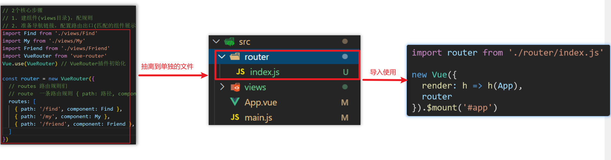

## 一、路由介绍

### 1.思考

单页面应用程序，之所以开发效率高，性能好，用户体验好

最大的原因就是：**页面按需更新**


比如当点击【发现音乐】和【关注】时，**只是更新下面部分内容**，对于头部是不更新的

要按需更新，首先就需要明确：**访问路径**和 **组件**的对应关系！

访问路径 和 组件的对应关系如何确定呢？ **路由**


### 2.路由的介绍

生活中的路由：设备和ip的映射关系


Vue中的路由：**路径和组件**的**映射**关系


### 3.总结

- 什么是路由
- Vue中的路由是什么


## 二、路由的基本使用

### 1.目标

认识插件 VueRouter，掌握 VueRouter 的基本使用步骤

### 2.作用

**修改**地址栏路径时，**切换显示**匹配的**组件**

### 3.说明

Vue 官方的一个路由插件，是一个第三方包

### 4.官网

<https://v3.router.vuejs.org/zh/>

### 5.VueRouter的使用（5+2）

固定5个固定的步骤（不用死背，熟能生巧）

1. 下载 VueRouter 模块到当前工程，版本3.6.5

   ```bash
   yarn add vue-router@3.6.5
   ```

2. main.js中引入VueRouter

   ```vue
   import VueRouter from 'vue-router'
   ```

3. 安装注册

   ```vue
   Vue.use(VueRouter)
   ```

4. 创建路由对象

   ```vue
   const router = new VueRouter()
   ```

5. 注入，将路由对象注入到new Vue实例中，建立关联

   ```vue
   new Vue({
     render: h => h(App),
     router:router
   }).$mount('#app')
   
   ```


当我们配置完以上5步之后 就可以看到浏览器地址栏中的路由 变成了 /#/的形式。表示项目的路由已经被Vue-Router管理了


### 6.代码示例

main.js

```vue
// 路由的使用步骤 5 + 2
// 5个基础步骤
// 1. 下载 v3.6.5
// yarn add vue-router@3.6.5
// 2. 引入
// 3. 安装注册 Vue.use(Vue插件)
// 4. 创建路由对象
// 5. 注入到new Vue中，建立关联


import VueRouter from 'vue-router'
Vue.use(VueRouter) // VueRouter插件初始化

const router = new VueRouter()

new Vue({
  render: h => h(App),
  router
}).$mount('#app')
```


### 7.两个核心步骤

1. 创建需要的组件 (views目录)，配置路由规则

   

2. 配置导航，配置路由出口(路径匹配的组件显示的位置)

   App.vue

   ```vue
   <div class="footer_wrap">
     <a href="#/find">发现音乐</a>
     <a href="#/my">我的音乐</a>
     <a href="#/friend">朋友</a>
   </div>
   <div class="top">
     <router-view></router-view>
   </div>
   ```

### 8.总结

1. 如何实现 路径改变，对应组件 切换,应该使用哪个插件?
2. Vue-Router的使用步骤是什么(5+2)?


## 三、组件的存放目录问题

注意： **.vue文件** 本质无区别

### 1.组件分类

 .vue文件分为2类，都是 **.vue文件（本质无区别）**

- 页面组件 （配置路由规则时使用的组件）
- 复用组件（多个组件中都使用到的组件）


### 2.存放目录

分类开来的目的就是为了 **更易维护**

1. src/views文件夹

   页面组件 - 页面展示 - 配合路由用

2. src/components文件夹

   复用组件 - 展示数据 - 常用于复用


### 3.总结

- 组件分类有哪两类？分类的目的？
- 不同分类的组件应该放在什么文件夹？作用分别是什么？


## 四、路由的封装抽离

问题：所有的路由配置都在main.js中合适吗？

目标：将路由模块抽离出来。  好处：**拆分模块，利于维护**



路径简写：

**脚手架环境下** @指代src目录，可以用于快速引入组件


总结：

- 路由模块的封装抽离的好处是什么？
- 以后如何快速引入组件？